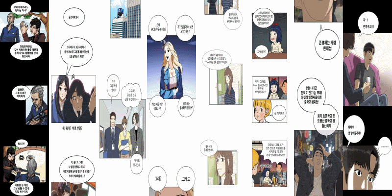

# WORD: Webtoon Object Recognition and Detection

`Note : It's not the final version code. I will the refine and update the code over and over again.`
### Sample Results

### Overview

WORD detect objects(speech bubbles, cuts, and line texts) in webtoon or cartoon. You can also meet ocr(line text detection + recognition) results and English translation with papago API if you want. 
I have referenced and used [CRAFT-pytorch](https://github.com/clovaai/CRAFT-pytorch) to detect line text, [Faster-RCNN-pytorch](https://github.com/jwyang/faster-rcnn.pytorch/tree/pytorch-1.0) to detect speech bubble.
And I have implemented all the code to find elaborately contours of speech bubble, detect cut with image processing(OpenCV) and recognize korean text with res-18 network.    
You can check README.md for each project folder if you want more details.
`[Image Source]:cells of Yumi, welcome to convinience store, love revolution, naver webtoon, and header of gangs, One Piece. `



## Updates 
**12 Nov, 2019** : Initially added Speech Bubble Detection Test Results.

**21 Nov, 2019** : Added Webtoon Cut Detection Test Results and Pretrained Model.

**24 Nov, 2019** : Added Text within Speech bubble Detection code and Classic toon test Results.

**17 Dec, 2019** : Merged all the code of prejects and added OCR and Translation Results.

## Install Requirements:
1、Pytorch==1.0.0(only)
```
pip install -r requirements.txt
```        
```
cd lib
python setup.py build develop
```    

## Pretrained Models
 *Model name* | *Model Link* |
 | :--- | :--- |
Speech Bubble Detector | [Click](https://drive.google.com/open?id=1F10sRXWuICKuSQclaUnQVBo1rlxa6ogR)
Line Text Detector | [Click](https://drive.google.com/open?id=1gL0-2IdSqIBN1o3W2AWEtOQRab-t5wx8)
Line Text Recognizer | [Click](https://drive.google.com/open?id=1hhAER4rz6Ucgs0J-VzPuIeXbN5ReDOka)

`Download model and include to weights/`

## Demo
`Note: When you test own your test cartoon images including several objects, You can get the segmentation results of speech bubble, cut, line texts.`

- Run **`python demo.py`**
# Acknowledgement
Thanks for jwyang excellent work and code
https://github.com/jwyang/faster-rcnn.pytorch/tree/pytorch-1.0) for train and test. 
