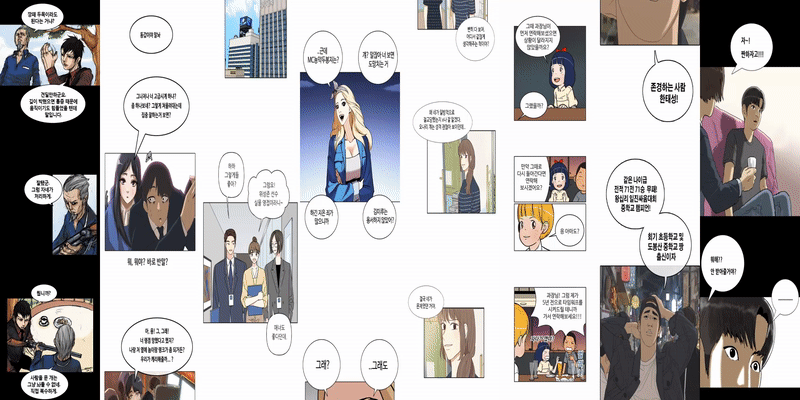

# WORD: Webtoon Object Recognition and Detection

`Note : It's not the final version code. I will the refine and update the code over and over again. Especially, I'm planning to add sound effect detector.`

***WARNING***: Size of test image is important. Please ***keep the ratio width : height = 1 : 2 ~ 3***
### Sample Results

### Overview

WORD detect objects(speech bubbles, cuts, and line texts) in webtoon or cartoon. You can also meet ocr(line text detection + recognition) results and English translation with papago API if you want. I have referenced and implemented [CRAFT-pytorch](https://github.com/clovaai/CRAFT-pytorch) to detect line text, used [Faster-RCNN-pytorch](https://github.com/jwyang/faster-rcnn.pytorch/tree/pytorch-1.0) to detect speech bubble. And I have implemented all the code to find elaborately contours of speech bubble, detect cut with image processing(OpenCV) and about korean text recognition model. You can check README.md for each project folder([object_detection](./object_detection/),  [text_detection](./text_detection/), [text_recognition](./text_recognition/)) if you want more details.



`[Image Source]:cells of Yumi, girl of random chat, mamamian, lookism, free throw, king of bok-hak, world of girl, naver webtoon, and header of gangs. `


## Updates 
**12 Nov, 2019** : Initially added Speech Bubble Detection Test Results.

**21 Nov, 2019** : Added Webtoon Cut Detection Test Results and Pretrained Model.

**24 Nov, 2019** : Added Text within Speech bubble Detection code and Classic toon test Results.

**17 Dec, 2019** : Merged all the code of prejects and added OCR and Translation Results.

## Install Requirements: 

`Pytorch==1.0.0(only)`

if you want to set anaconda env, `conda create -n WORD python=3.6` `conda activate WORD` and follow the next step.

```
pip install -r requirements.txt
```        
```
cd object_detection/lib/
python setup.py build develop
```    

## Pretrained Models
 *Model name* | *Model Link* |
 | :--- | :--- |
Speech Bubble Detector | [Click](https://drive.google.com/open?id=1F10sRXWuICKuSQclaUnQVBo1rlxa6ogR)
Line Text Detector | [Click](https://drive.google.com/open?id=1gL0-2IdSqIBN1o3W2AWEtOQRab-t5wx8)
Line Text Recognizer | [Click](https://drive.google.com/open?id=1hhAER4rz6Ucgs0J-VzPuIeXbN5ReDOka)

Download model and include to `weights/`

## Demo
`Note: When you test own your test toon images including several objects, You can get the segmentation results of speech bubble and cut. Yon can also get OCR, English translation results.`
1. Download models above link
2. Add image files to `data/`
3. Run demo.py (add `--ocr --papago` options if you want)

- Run **`python demo.py --ocr --papago `**

### Arguments

* `--object_detector`: folder path to trained speech bubble detector.
* `--text_detector`: folder path to trained line text detector.
* `--text_recognizer`: folder path to trained line text recognizer.
* `--object`: enable object detection.
* `--ocr`: enable ocr(text detection + text recognition). 
* `--papago`: enable translation with papago API. 
* `--type`: select background type of toon [white | black | classic]. `default : white`
* `--cls`: probability of speech bubble detection for filtering 
* `--box_size`: threshold of cut size for filtering
* `--large_scale`: whether demo image is large scale.
* `--ratio`: ratio of height to width of large scale image
* `--demo_folder`: folder path to demo images
* `--cuda`: use cuda for inference.


## Train
If you want to train own your model, you can check `train.py` of [object_detection](./object_detection/README.md#L17), [text_detection](./text_detection/README.md), or [text_recognition](./text_recognition/README.md)

## Reference
Thanks for jwyang. [FasterRCNN-pytorch](https://github.com/jwyang/faster-rcnn.pytorch/tree/pytorch-1.0) for train and test.

Thanks for Youngmin Baek. [CRAFT-pytorch](https://github.com/clovaai/CRAFT-pytorch) for test.

Thanks for [papago API](https://github.com/naver/naver-openapi-guide/tree/master/ko/papago-apis) of naver corp

Thanks for pvaneck. [Hangul Character Recognition](https://github.com/IBM/tensorflow-hangul-recognition)

Thanks for kuangliu. [Recognition Network](https://github.com/kuangliu/pytorch-cifar)
