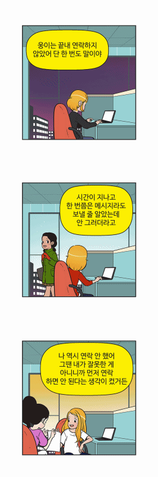
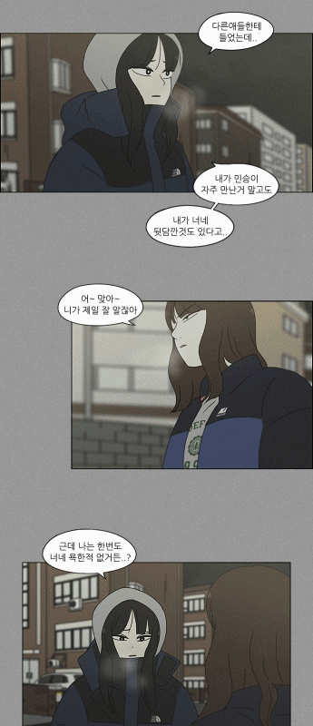

# TOON OBJECT[Cut, Speech Bubble, and, Lines Text] Detection based on Faster R-CNN and OpenCV

`Note : It's not the final version code. I will the refine and update the code over and over again.`
### Sample Results

### Overview
`This is TOON Object Detection with Faster RCNN and Image Processing Technology. Now, my project CAN detect speech bubble, lines text, and cut. I also planning to seperate character and special text(sound effects in toon). 

[Image Source]:cells of Yumi, welcome to convinience store, love revolution, naver webtoon, and header of gangs, One Piece`



## Faster R-CNN: Towards Real-Time Object Detection with Region Proposal Networks
Shaoqing Ren, Kaiming He, Ross Girshick, Jian Sun
(Last revised on 6 Jan 2016(v3)) [Faster RCNN](https://arxiv.org/pdf/1506.01497.pdf)

## Updates 
**12 Nov, 2019** : Initially added Speech Bubble Detection Test Results.

**21 Nov, 2019** : Added Webtoon Cut Detection Test Results and Pretrained Model.

**24 Nov, 2019** : Added Text within Speech bubble Detection code and Classic toon test Results.

## Install Requirements:
1、Pytorch==1.0.0(only)
```
pip install -r requirements.txt
```        
```
cd lib
python setup.py build develop
```    

## Pretrained Models
 *Model name* | *Model Link* |
 | :--- | :--- |
Speech Bubble Detector | [Click](https://drive.google.com/open?id=1F10sRXWuICKuSQclaUnQVBo1rlxa6ogR)


`Download model and include pretrained_models/`


## Training
`Note: When you train own your datasets, You ONLY need to have Speech Bubble Bounding box labels. In other words, this code CAN segmentation Speech Bubble Object, but DON'T need segmetation data. training code will be released in the near future. But, speech bubble datasets can't release bacause of company policy`

## Test
`Note: When you test own your test cartoon images including several objects, You can get the segmentation results of speech bubble, cut, line texts.`

- Run **`python kick_off.py --test 1`**
# Acknowledgement
Thanks for jwyang excellent work and code
https://github.com/jwyang/faster-rcnn.pytorch/tree/pytorch-1.0) for train and test. 
