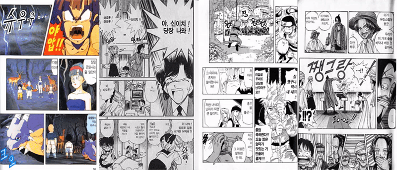
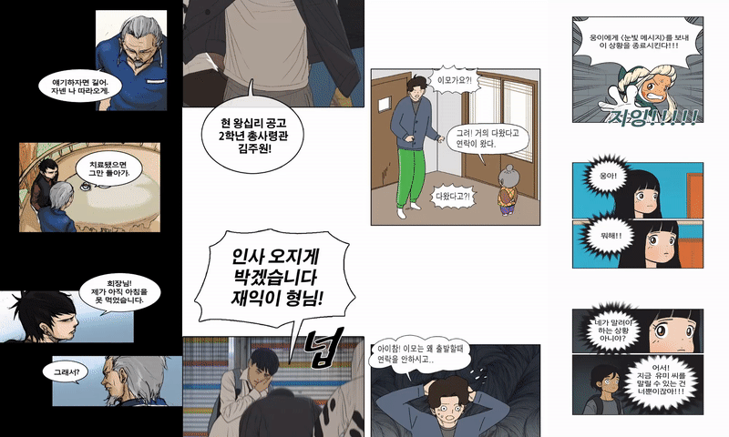

# Object Detection in toon based on Faster R-CNN and OpenCV

```
The remaining issues : 
1. Result of bubble contour detection is not perfect. If bounding box of bubble is detected more elaborately with post processing, It is possible to improve performance.
2. Cut detection is a limit about the case to seperate cuts which obstacles(sound effects, characters, etc.) go through. So, if obstacle is firstly detached from cuts, It's also possible to improve performance.
```
### Sample Results

### Overview
This is Object Detection with Faster RCNN and Image Processing Technology. Firstly, faster RCNN detects bounging boxes of speech bubbles and then, segmentation result of speech bubble is detected by using image processing technologies
[(max area contours)](./bubble_utils.py#L42). Secondly, Cut is detected from input image detached from speech bubble. I have used [numpy canvas](./cut.py#L32), and [convexHull methods](./cut_utils.py#L7) to detect cut.

`cut results: [image source] : Dragon-Ball, Detective Conan, Naruto, One-Piece`


`bubble results: [image source] : Header of gangs, Free-throw, Zombie-Daughter, Cells-of-Yumi`



## Faster R-CNN: Towards Real-Time Object Detection with Region Proposal Networks
Shaoqing Ren, Kaiming He, Ross Girshick, Jian Sun
(Last revised on 6 Jan 2016(v3)) [Faster RCNN](https://arxiv.org/pdf/1506.01497.pdf)

## Train
`Note: Training process is almost identical to original's repo, but rewrote code style and order for same structure. Anyway, It is sometimes unstable when datasets, optimizer, batch, or lr, etc was changed. So, you can refer to`[Issues of faster RCNN's original repo](https://github.com/jwyang/faster-rcnn.pytorch/issues)

Speech bubble datasets and methodologies to get data can't release bacause of [company](http://www.ideaconcert.com/) policy. I got all the data of speech bubbles automatically from PSD file and suitable post processing method. Format of train data follows pascal voc, object detection dataset. So, you have to make labels as xml extension.

1. Download models to following original author's link : ([vgg16](https://www.dropbox.com/s/s3brpk0bdq60nyb/vgg16_caffe.pth?dl=0) | [res101](https://www.dropbox.com/s/iev3tkbz5wyyuz9/resnet101_caffe.pth?dl=0)) and then, add to `weights/` 
2. Add images and labels to `train/images/` and `train/labels/` 
- Run **`python train.py`** together below argument options.

### Arguments for train 

* `--save_models`: saving model folder path
* `--epoch`: epoch
* `--batch`: batch size
* `--backbone`: backbone model network : res101 | vgg16
* `--num_workers`: the number of cpu core for data processing
* `--lr`: learning rate
* `--lr_decay_step`: learning rate decay step
* `--lr_decay_gamma`: learning rate decay gamma
* `--multi_gpus`: enable multi_gpus
* `--large_scale`: whether use large imag scale
* `--class_agnostic`: whether to perform class_agnostic bbox regression
* `--optimizer`: training optimizer : adam | sgd
* `--session`: raining session
* `--resume`: resume checkpoint or not
* `--resume_epoch`: resume epoch point
* `--resume_batch`: resume batch size
* `--use_tfboard`: whether use tensorboard
* `--display_interval`: display train log per display_interval 
