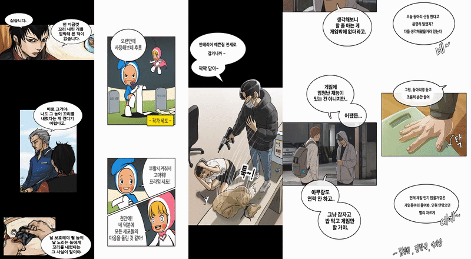

# Line Text Detection based on CRAFT(Character-Region Awareness For Text detection)
```
The remaining issues : 
1. Performance of text detection is excellent itself. But remarkable problem is that text detection should be to take overhead of recognition, which is to predict each character very exactly, because recognition model perporms recognition by one character unit.
2. model of text detection is a trained CRAFT-model by naver clova ai because performance can't reach author's models although train code was implemented.
```
### Sample Results

### Overview
This is Line Text Detection with CRAFT. Firstly, CRAFT detects Line text character of Speech Bubble as shape of gaussian heatmap. Secondly, predicted result post-processed as character, words, line unit for sorting order of characters and adding spacing word to final ocr result. I also implemented [post-process of link-refine](./ltd_utils.py#L11) which is used as box coordinates for warpping translated results instead of [link-refiner-model](https://github.com/clovaai/CRAFT-pytorch/blob/master/refinenet.py)

`line results: [image source] : header of gangs, cells of Yumi, king of bok-hak, free throw, girl of random chat`


### Character Region Awareness for Text Detection
Youngmin Baek, Bado Lee, Dongyoon Han, Sangdoo Yun, Hwalsuk Lee
(Submitted on 3 Apr 2019) [CRAFT](https://arxiv.org/pdf/1904.01941.pdf)
                                                                                                                                    
### Train
When you train own your datasets, You have to make labels as json extension only. And It doesn't contain [weakly supervision](https://khanrc.tistory.com/entry/Semisupervised-Weaklysupervised) part of original paper because webtoon domain follows things synthetic, not real. So, a labeling doesn't divide characters from word, but can be [generated with train image](https://github.com/Belval/TextRecognitionDataGenerator).

- Run **`python train.py`** together below argument options.

### Arguments for train

* `--save_models`: saving model folder path
* `--epoch`: epoch
* `--batch`: batch size
* `--lr`: learning rate
* `--lr_decay_step`: learning rate decay step
* `--lr_decay_gamma`: learning rate decay gamma
* `--train_size`: train image size
* `--display_interval`: display train log per display_interval
* `--save_interval`: save checkpoint per save_interval
* `--rotate`: data augmentation: rotate
* `--flip`: data augmentation: flip
* `--crop`: data augmentation: crop
* `--vis_train`: whether checks model prediction with image
* `--region`: gaussian heatmap labeling region scope
* `--affinity`: gaussian heatmap labeling affinity scope

