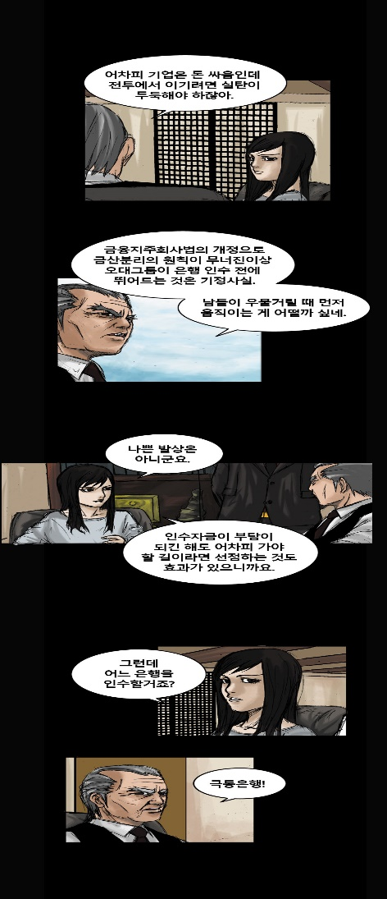
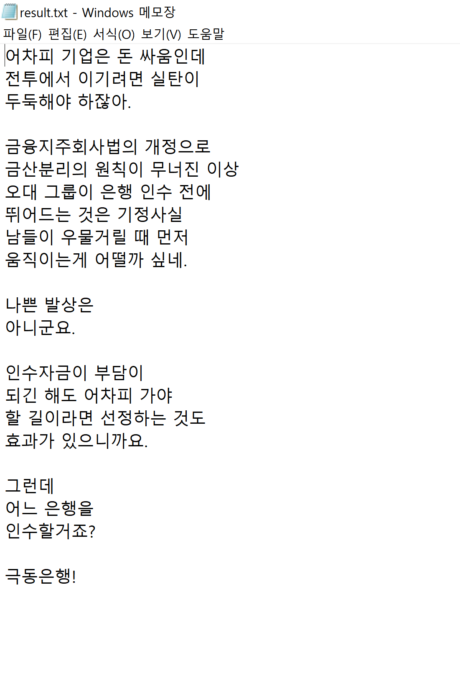

# Line Text Recognition for Korean Language (Hangul)

The remaining issues :
1. This methodology which recognize one character unit is NOT state-of-the-art. So, you can reference [crnn-pytorch](https://github.com/meijieru/crnn.pytorch) and more detailed methodology, [deep-text-recognition-benchmark](https://github.com/clovaai/deep-text-recognition-benchmark)
for better performance. (Strongly recommended)
2. If you want to increase performance with this model, You can change [backbone network](./backbone/) or [train real-webtoon data](./TRAIN_WEBTOON.md) additionally.

### Sample Results

### Overview
This is Line Text Recognition for Korean Language (Hangul). Firstly, one character unit, result of [Text Detection](../text_detection/) is used as input image.
After Recognizer model predicts all the characters, text_file is generated which all the results is written to. Spacing word can be also recognized through
[ltd_utils.py](../text_detection/ltd_utils.py), post-process step of text detection.

### Create Dataset
1. Add [fonts](https://software.naver.com/search.nhn?query=%ED%8F%B0%ED%8A%B8) to `train/fonts/`
- Run **`python create_dataset.py`** 

### Arguments for creating Dataset

* `--salt_pepper`: data augmentation : salt and pepper noise generation
* `--chunk_noise`: data augmentation : chunk noise generation
* `--webtoon_data`: enable webtoon data to be added into train data. 

### Train

- Run **`python train.py`** together below argument options.

### Arguments for train

* `--save_models`: saving model folder path
* `--epoch`: epoch
* `--batch`: batch size
* `--lr`: learning rate
* `--lr_decay_step`: learning rate decay step
* `--lr_decay_gamma`: learning rate decay gamma
* `--train_size`: train image size
* `--display_interval`: display train log per display_interval
* `--save_interval`: save checkpoint per save_interval
* `--blur`: data augmentation: blurring
* `--distort`: data augmentation: distort
