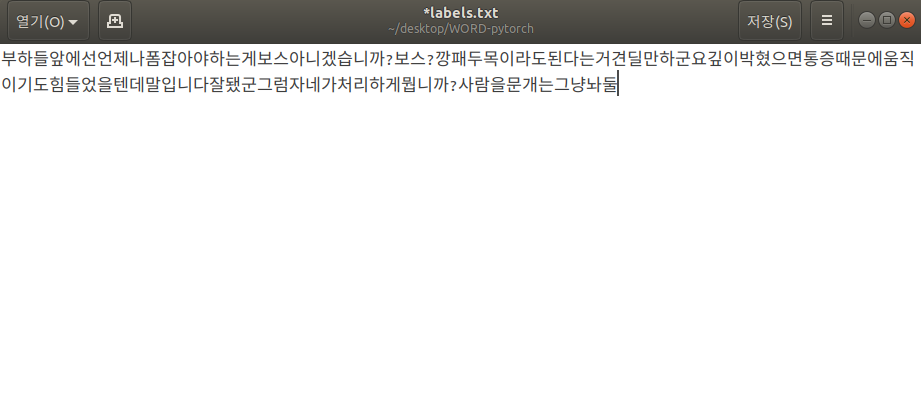
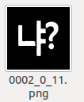

## How to train webtoon data

1. ``` Run demo.py --ocr ``` and then, you can get the data for text recognition below this. 


2. you can select all the data or incorrect predicted data for training. But I recommend all the data 
because of decreasing [data imbalanced problem](https://ourcstory.tistory.com/239)

3. Anyway, you should type each character data to text file below this. It will be training ground truth of recognition.



4. Move all the data and labels.txt to RECOG_WEBTOON_TRAIN_DATA_PATH, RECOG_WEBTOON_TRAIN_LABEL_PATH of [opt.py](../opt.py)

5. Finally, ``` Run create_dataset.py --webtoon_data ```. you can include webtoon data for training and get model better to recognize.

**NOTE**: `the following data can't be considered training data. So, It must be excluded.`


